# Flink on Kubernetes 调度流程与 Job 启动流程深度分析

> 基于 Apache Flink 源码的深度解析，涵盖集群启动、Job 提交、资源调度、Pod 管理全链路。

---

## 目录

- [1. 架构总览](#1-架构总览)
- [2. 核心组件介绍](#2-核心组件介绍)
- [3. 集群启动流程](#3-集群启动流程)
- [4. Job 提交与启动流程](#4-job-提交与启动流程)
- [5. 资源调度与 Slot 管理](#5-资源调度与-slot-管理)
- [6. Kubernetes Pod 生命周期管理](#6-kubernetes-pod-生命周期管理)
- [7. Pod 装饰器模式详解](#7-pod-装饰器模式详解)
- [8. 容错与恢复机制](#8-容错与恢复机制)
- [9. 关键源码索引](#9-关键源码索引)

---

## 1. 架构总览

### 1.1 整体架构图

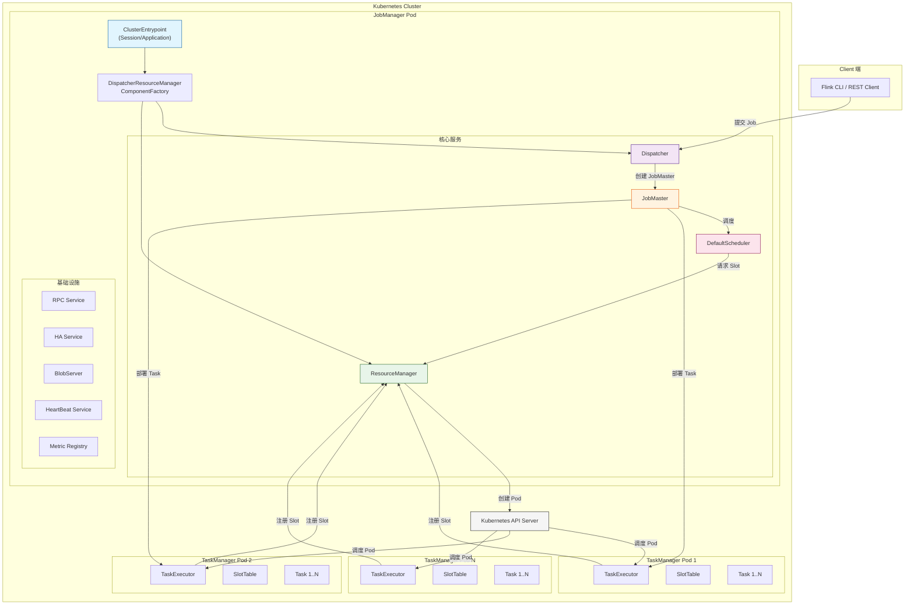

### 1.2 两种部署模式

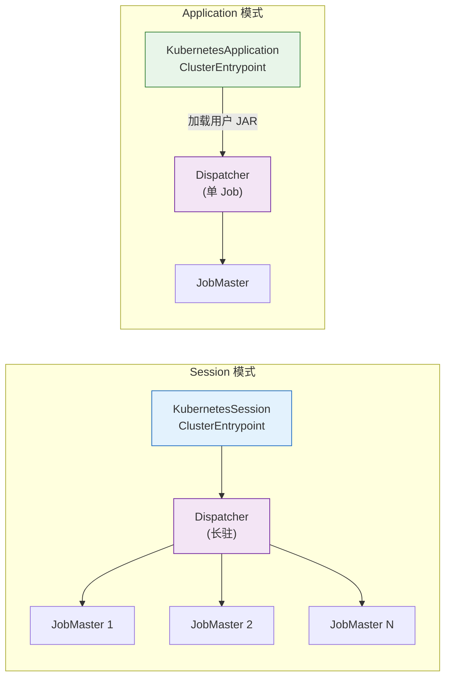

| 特性 | Session 模式 | Application 模式 |
|------|-------------|-----------------|
| 入口类 | `KubernetesSessionClusterEntrypoint` | `KubernetesApplicationClusterEntrypoint` |
| 生命周期 | 长驻运行，接受多 Job | 单 Job，完成后关闭 |
| Job 提交 | Client 远程提交 | 内部自动提交 |
| 适用场景 | 多 Job 共享集群 | 独立 Job 运行 |

---

## 2. 核心组件介绍

### 2.1 组件交互关系图

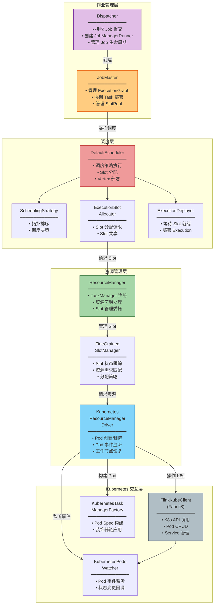

### 2.2 核心组件职责说明

| 组件 | 源码路径 | 核心职责 |
|------|---------|---------|
| **ClusterEntrypoint** | `flink-runtime/.../entrypoint/ClusterEntrypoint.java` | JVM 进程入口，初始化所有基础服务 |
| **Dispatcher** | `flink-runtime/.../dispatcher/Dispatcher.java` | Job 路由器，接收提交并创建 JobMaster |
| **JobMaster** | `flink-runtime/.../jobmaster/JobMaster.java` | 单个 Job 的管家，管理执行图和 Slot 池 |
| **DefaultScheduler** | `flink-runtime/.../scheduler/DefaultScheduler.java` | 核心调度引擎，决定何时何地执行 Task |
| **ResourceManager** | `flink-runtime/.../resourcemanager/ResourceManager.java` | 资源协调者，管理 TaskManager 注册和心跳 |
| **FineGrainedSlotManager** | `flink-runtime/.../slotmanager/FineGrainedSlotManager.java` | 细粒度 Slot 管理，匹配需求与资源 |
| **KubernetesResourceManagerDriver** | `flink-kubernetes/.../KubernetesResourceManagerDriver.java` | K8s 驱动层，将资源请求转化为 Pod 操作 |
| **FlinkKubeClient** | `flink-kubernetes/.../kubeclient/Fabric8FlinkKubeClient.java` | K8s API 封装，基于 Fabric8 库 |

---

## 3. 集群启动流程

### 3.1 集群启动时序图

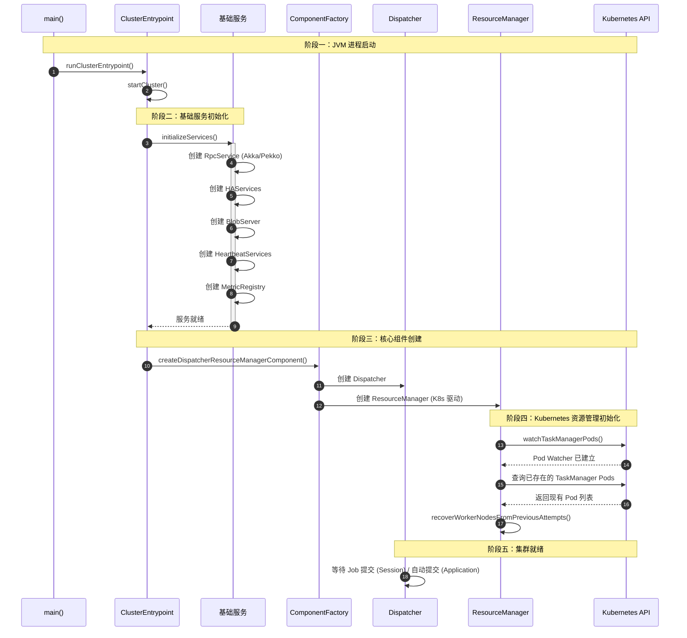

### 3.2 启动流程详解

#### Session 模式启动

```
KubernetesSessionClusterEntrypoint.main()
│
├── KubernetesEntrypointUtils.loadConfiguration()
│   ├── 读取 FLINK_CONF_DIR 下的配置
│   ├── 如果使用 Host Network → 设置端口为 0 (自动分配)
│   └── 如果启用 HA → 从 POD_IP 环境变量设置 JM 地址
│
├── ClusterEntrypoint.runClusterEntrypoint(entrypoint)
│   └── entrypoint.startCluster()
│       ├── initializeServices(configuration)
│       │   ├── 创建 commonRpcService (RPC 通信)
│       │   ├── 创建 haServices (高可用)
│       │   ├── 创建 blobServer (大文件传输)
│       │   ├── 创建 heartbeatServices (心跳检测)
│       │   └── 创建 metricRegistry (监控指标)
│       │
│       └── runCluster(configuration, pluginManager)
│           └── createDispatcherResourceManagerComponentFactory()
│               │   → DefaultDispatcherResourceManagerComponentFactory
│               │       使用 KubernetesResourceManagerFactory
│               │
│               └── factory.create(...)
│                   ├── 创建 Dispatcher (接受 Job)
│                   └── 创建 ResourceManager (管理资源)
│                       └── KubernetesResourceManagerDriver.initializeInternal()
│                           ├── watchTaskManagerPods() — 监听 Pod 事件
│                           └── recoverWorkerNodesFromPreviousAttempts() — 恢复历史 Pod
```

#### Application 模式启动

```
KubernetesApplicationClusterEntrypoint.main()
│
├── 加载配置 (同 Session)
├── 初始化基础服务 (同 Session)
├── 创建 DispatcherResourceManagerComponent (同 Session)
│
└── 额外步骤:
    ├── getPackagedProgram() — 从远程获取用户 JAR
    ├── configureExecution() — 配置执行参数
    └── 自动提交并执行 Job (不等待外部提交)
```

---

## 4. Job 提交与启动流程

### 4.1 Job 提交全链路时序图

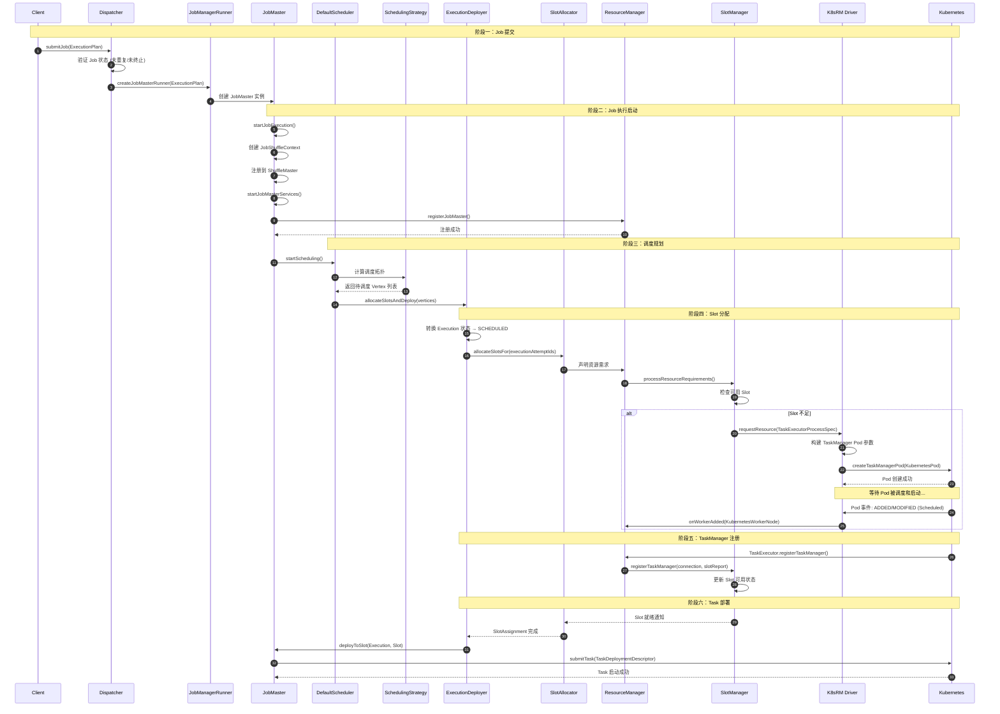

### 4.2 Job 提交详细流程

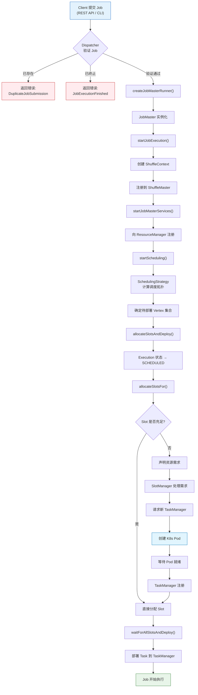

### 4.3 核心源码调用链

```
Dispatcher.submitJob()                     [Dispatcher.java:774]
  └─ Dispatcher.createJobMasterRunner()    [Dispatcher.java:1265]
     └─ jobManagerRunnerFactory.createJobManagerRunner()
        └─ JobMaster 构造函数
           └─ JobMaster.startJobExecution() [JobMaster.java:1172]
              ├─ createJobShuffleContext()
              ├─ startJobMasterServices()   [JobMaster.java:1178]
              └─ startScheduling()          [JobMaster.java:1272]
                 └─ schedulerNG.startScheduling()
                    └─ DefaultScheduler.allocateSlotsAndDeploy()  [DefaultScheduler.java:485]
                       └─ executionDeployer.allocateSlotsAndDeploy()
                          └─ DefaultExecutionDeployer [DefaultExecutionDeployer.java:90]
                             ├─ allocateSlotsFor() → ExecutionSlotAllocator
                             └─ waitForAllSlotsAndDeploy()
```

---

## 5. 资源调度与 Slot 管理

### 5.1 资源请求与分配流程

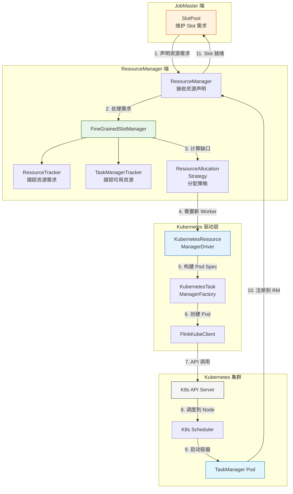

### 5.2 SlotManager 工作机制

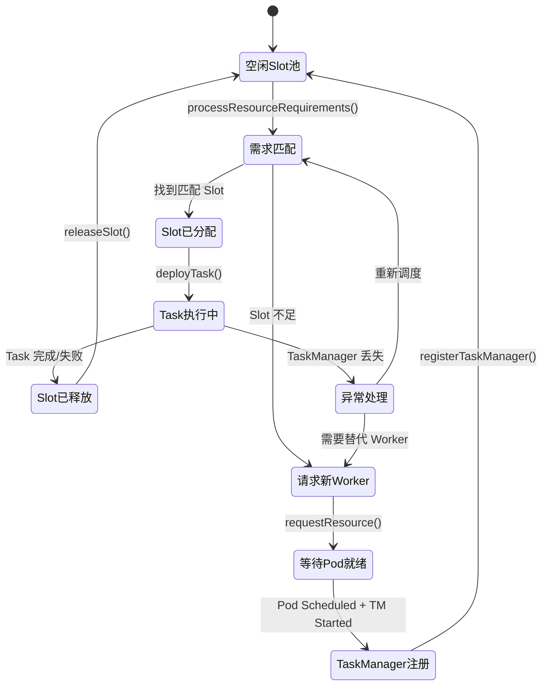

### 5.3 FineGrainedSlotManager 核心逻辑

`FineGrainedSlotManager` 是 Kubernetes 部署下的默认 SlotManager 实现，采用声明式资源管理：

```
FineGrainedSlotManager 核心组件:
│
├── TaskManagerTracker    — 跟踪所有已注册的 TaskManager 及其 Slot
│   ├── 已注册 TM 列表
│   ├── 每个 TM 的 Slot 状态 (空闲/已分配/待分配)
│   └── TM 资源概况 (CPU/Memory)
│
├── ResourceTracker       — 跟踪所有 Job 的资源需求
│   ├── 各 Job 的 ResourceRequirement
│   └── 需求变更事件
│
├── ResourceAllocationStrategy — 资源分配决策
│   ├── 匹配现有 Slot 到需求
│   ├── 计算还需要多少新 Worker
│   └── 决定是否释放多余 Worker
│
└── SlotStatusSyncer      — Slot 状态同步
    ├── 同步 TM 上报的 Slot 状态
    └── 处理 Slot 分配/释放的状态更新
```

**关键方法调用链:**

| 方法 | 位置 | 说明 |
|------|------|------|
| `processResourceRequirements()` | `SlotManager.java:101` | 处理 Job 的资源需求声明 |
| `registerTaskManager()` | `SlotManager.java:113` | 注册新的 TaskManager |
| `reportSlotStatus()` | `SlotManager.java:136` | 接收 TM 的 Slot 状态上报 |
| `triggerResourceRequirementsCheck()` | `SlotManager.java:153` | 触发资源需求检查 |

---

## 6. Kubernetes Pod 生命周期管理

### 6.1 Pod 创建流程

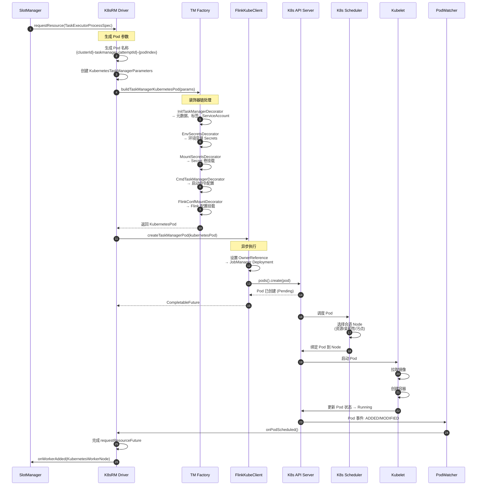

### 6.2 Pod 生命周期状态机

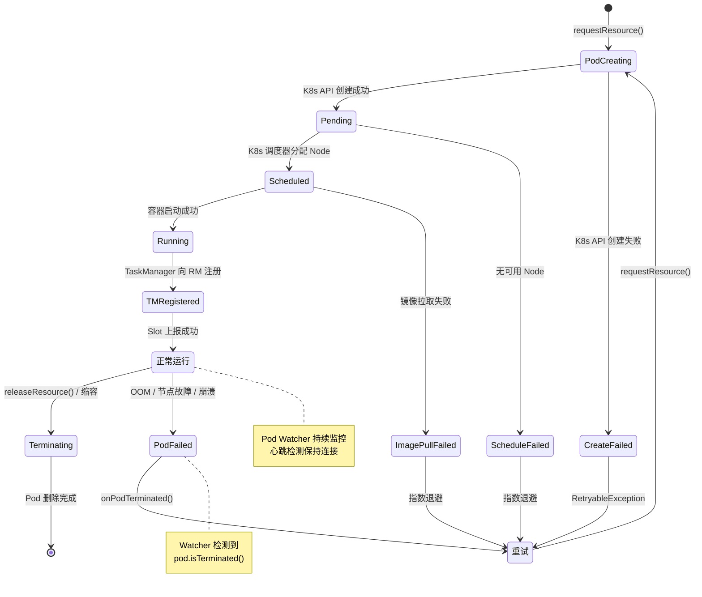

### 6.3 Pod 事件处理机制

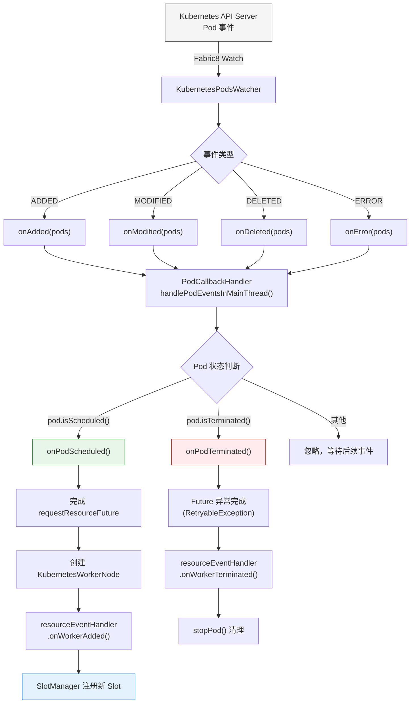

### 6.4 Pod 命名规范

```
格式: {clusterId}-taskmanager-{attemptId}-{podIndex}
示例: my-flink-cluster-taskmanager-0-3

┌────────────────────┬─────────────┬──────────┬──────────┐
│    clusterId       │   固定前缀   │ attemptId│ podIndex │
│  my-flink-cluster  │ taskmanager │    0     │    3     │
└────────────────────┴─────────────┴──────────┴──────────┘

命名正则: \S+-taskmanager-([\d]+)-([\d]+)
```

- **clusterId**: 集群唯一标识，来自配置
- **attemptId**: ResourceManager 重启次数，用于区分不同代
- **podIndex**: 在当前 attempt 中的递增编号

---

## 7. Pod 装饰器模式详解

### 7.1 装饰器架构

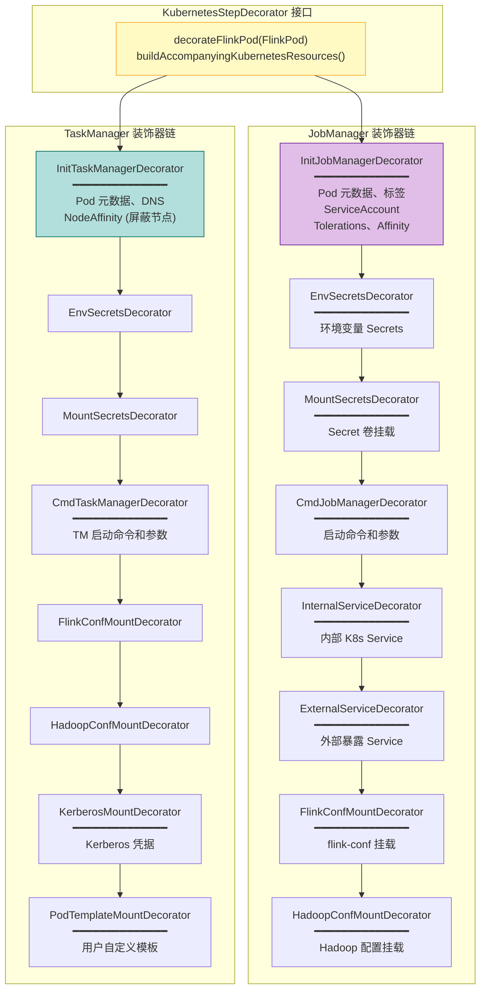

### 7.2 装饰器处理流程

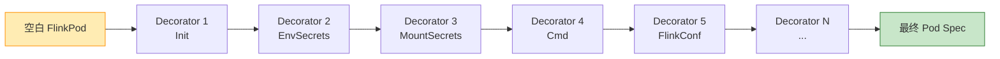

每个装饰器接收一个 `FlinkPod`，在其基础上添加配置后返回新的 `FlinkPod`：

```java
// 装饰器链伪代码
FlinkPod pod = new FlinkPod.Builder().build();
for (KubernetesStepDecorator decorator : decorators) {
    pod = decorator.decorateFlinkPod(pod);
}
// pod 现在包含所有配置
```

---

## 8. 容错与恢复机制

### 8.1 ResourceManager 重启恢复

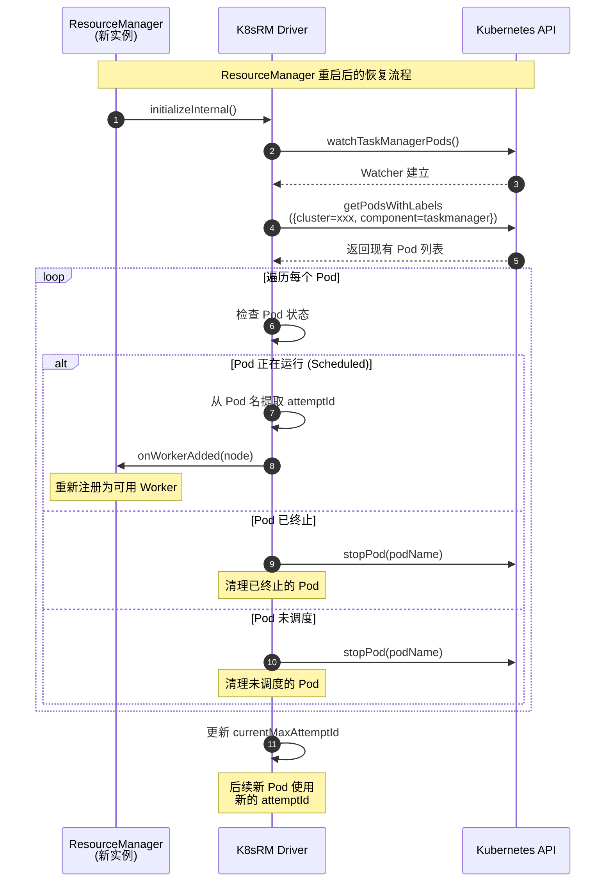

### 8.2 Pod 故障处理

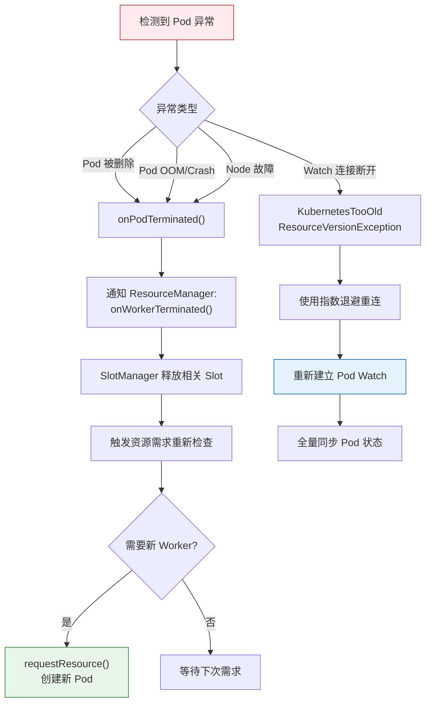

### 8.3 BlockList 机制

当某个 Kubernetes 节点频繁出错时，Flink 会将其加入黑名单：

```
InitTaskManagerDecorator 中会设置 NodeAffinity:
│
├── 检查 blockedNodes 列表
├── 如果有被屏蔽的节点
│   └── 设置 Pod 的 nodeAffinity:
│       └── requiredDuringSchedulingIgnoredDuringExecution:
│           └── nodeSelectorTerms:
│               └── matchExpressions:
│                   └── key: kubernetes.io/hostname
│                       operator: NotIn
│                       values: [blocked-node-1, blocked-node-2, ...]
│
└── 新创建的 Pod 不会被调度到这些节点上
```

---

## 9. 关键源码索引

### 9.1 Kubernetes 模块

| 文件 | 路径 | 核心方法 |
|------|------|---------|
| **KubernetesResourceManagerDriver** | `flink-kubernetes/src/.../KubernetesResourceManagerDriver.java` | `initializeInternal()`, `requestResource()`, `releaseResource()`, `onPodScheduled()`, `onPodTerminated()` |
| **KubernetesWorkerNode** | `flink-kubernetes/src/.../KubernetesWorkerNode.java` | `getAttempt()`, 资源 ID 编码 |
| **FlinkKubeClient** | `flink-kubernetes/src/.../kubeclient/FlinkKubeClient.java` | `createTaskManagerPod()`, `stopPod()`, `watchPodsAndDoCallback()` |
| **Fabric8FlinkKubeClient** | `flink-kubernetes/src/.../kubeclient/Fabric8FlinkKubeClient.java` | API 调用实现、OwnerReference 管理、重试逻辑 |
| **KubernetesJobManagerFactory** | `flink-kubernetes/src/.../factory/KubernetesJobManagerFactory.java` | JM Deployment 构建 |
| **KubernetesTaskManagerFactory** | `flink-kubernetes/src/.../factory/KubernetesTaskManagerFactory.java` | TM Pod 构建 |
| **KubernetesPodsWatcher** | `flink-kubernetes/src/.../resources/KubernetesPodsWatcher.java` | Pod 事件监听 |
| **KubernetesSessionClusterEntrypoint** | `flink-kubernetes/src/.../entrypoint/KubernetesSessionClusterEntrypoint.java` | Session 模式入口 |
| **KubernetesApplicationClusterEntrypoint** | `flink-kubernetes/src/.../entrypoint/KubernetesApplicationClusterEntrypoint.java` | Application 模式入口 |
| **KubernetesResourceManagerFactory** | `flink-kubernetes/src/.../entrypoint/KubernetesResourceManagerFactory.java` | RM 驱动工厂 |
| **KubernetesEntrypointUtils** | `flink-kubernetes/src/.../entrypoint/KubernetesEntrypointUtils.java` | 配置加载、端口处理 |

### 9.2 Runtime 核心模块

| 文件 | 路径 | 核心方法 |
|------|------|---------|
| **ClusterEntrypoint** | `flink-runtime/src/.../entrypoint/ClusterEntrypoint.java` | `startCluster()`, `initializeServices()`, `runCluster()` |
| **Dispatcher** | `flink-runtime/src/.../dispatcher/Dispatcher.java` | `submitJob()`, `createJobMasterRunner()` |
| **JobMaster** | `flink-runtime/src/.../jobmaster/JobMaster.java` | `startJobExecution()`, `startScheduling()`, `registerTaskManager()` |
| **DefaultScheduler** | `flink-runtime/src/.../scheduler/DefaultScheduler.java` | `allocateSlotsAndDeploy()` |
| **DefaultExecutionDeployer** | `flink-runtime/src/.../scheduler/DefaultExecutionDeployer.java` | `allocateSlotsAndDeploy()`, `waitForAllSlotsAndDeploy()` |
| **ResourceManager** | `flink-runtime/src/.../resourcemanager/ResourceManager.java` | `registerJobMaster()`, `registerJobMasterInternal()` |
| **SlotManager** | `flink-runtime/src/.../slotmanager/SlotManager.java` | `processResourceRequirements()`, `registerTaskManager()`, `reportSlotStatus()` |
| **FineGrainedSlotManager** | `flink-runtime/src/.../slotmanager/FineGrainedSlotManager.java` | 声明式 Slot 管理实现 |

### 9.3 关键设计模式

| 模式 | 应用场景 | 说明 |
|------|---------|------|
| **装饰器模式** | Pod 规格构建 | `KubernetesStepDecorator` 链式装饰 FlinkPod |
| **工厂模式** | 组件创建 | `KubernetesResourceManagerFactory`, `KubernetesJobManagerFactory` |
| **观察者模式** | Pod 事件监听 | `KubernetesPodsWatcher` + `WatchCallbackHandler` |
| **异步 Future** | K8s API 调用 | 所有 K8s 操作返回 `CompletableFuture` |
| **策略模式** | 调度与分配 | `SchedulingStrategy`, `ResourceAllocationStrategy` |
| **模板方法** | 集群入口点 | `ClusterEntrypoint` 定义骨架，子类实现差异 |

---

> **本文档基于 Apache Flink 源码分析生成，覆盖了 Flink on Kubernetes 的核心调度流程与 Job 启动全链路。**
